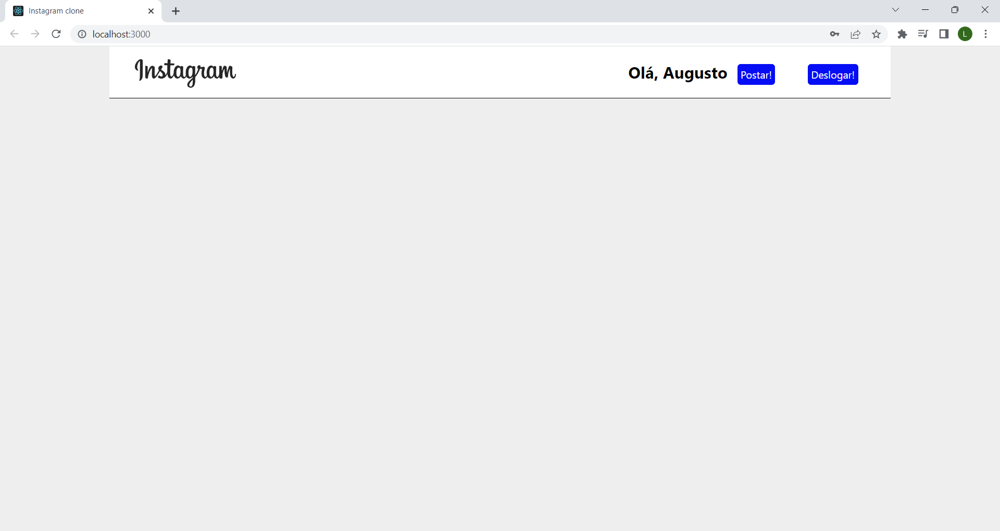

# Clone Página do Instagram

## Clone de algumas funcionalidades do instagram com react, firebase e css

 

* Configurações Firebase para começar:

 

### Comandos para inicia aplicação:]

* <small><b>
npm install react-scripts --save
 
npm start
</b></small>

## Video demostrativo

 

[Clique aqui para ver o video](video-demostrativo.mp4)

 

## Captura de tela 1

 

 

## Captura de tela 2

 
 

 

## Captura de tela 3

 
 

 

## Captura de tela 4

 
 

 

## Captura de tela 5

 
 

 

## Captura de tela 6

 
 

 

## Captura de tela 7

 
 

 